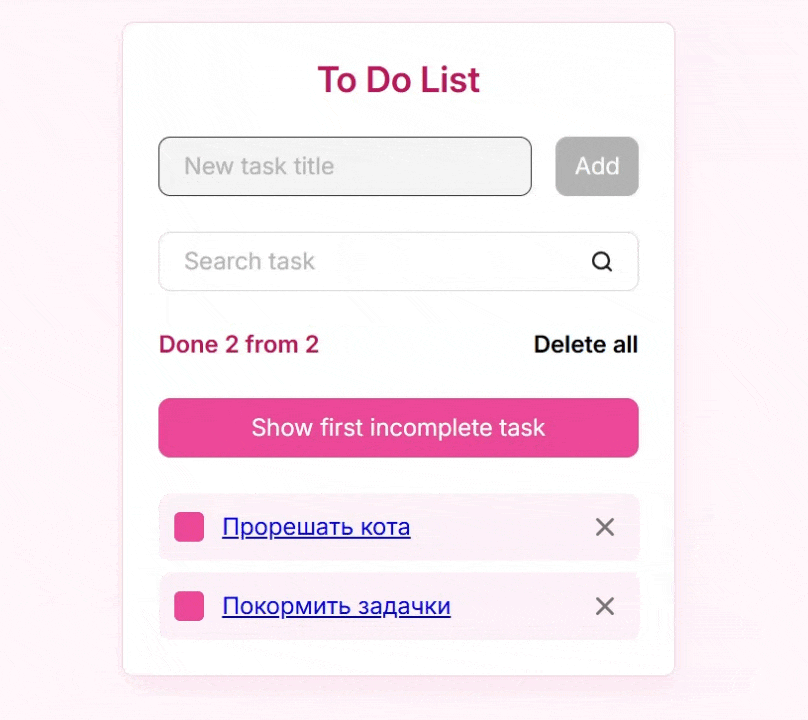

># 📝 Todo App (React)

Pet-проект, демонстрирующий разработку полноценного SPA-приложения на React с продуманной архитектурой, управлением состоянием и оптимизацией производительности.

---

## 📸 Превью

<p align="center">
  
</p>

---

## 🚀 О проекте

Это не просто todo-лист, а приложение, в котором я последовательно отрабатывала ключевые навыки frontend-разработчика:

* переход от простого состояния (`useState`) к более масштабируемому (`useReducer`)
* организация архитектуры с использованием Feature-Sliced Design
* работа с роутингом и навигацией в SPA
* оптимизация производительности React-приложения

---

## ✨ Функциональность

* ➕ Добавление и удаление задач
* ✅ Отметка выполнения
* 🔍 Поиск задач по названию
* 📄 Просмотр детальной информации о задаче (отдельный роут)
* ⏮️ Переход к первой невыполненной задаче
* 💾 Сохранение данных (localStorage → JSON server)
* 📱 Адаптивный интерфейс

---

## 🛠️ Технологический стек

* React (JavaScript, JSX)
* React Hooks: useState, useReducer, useEffect, useRef, useMemo, useCallback
* React Router
* Context API
* Feature-Sliced Design (FSD)
* JSON Server (эмуляция backend API)
* GitHub Pages (деплой)

---

## 🧠 Ключевые решения

### Архитектура

Проект структурирован по методологии Feature-Sliced Design, что позволяет:

* масштабировать приложение
* изолировать бизнес-логику
* переиспользовать компоненты

### Управление состоянием

* использован `useReducer` для более предсказуемой логики
* Context API для избежания prop drilling
* кастомные хуки для переиспользования логики

### Оптимизация

* React.memo, useMemo, useCallback
* контроль ререндеров компонентов

---

## 🔄 Работа с данными

* Изначально: `localStorage`
* Затем: переход на JSON Server для имитации REST API
  (работа с асинхронными запросами и побочными эффектами)

---

## 🔀 Навигация

* реализован SPA с помощью React Router
* у каждой задачи есть отдельная страница
* переходы без перезагрузки

---

## 📦 Установка и запуск

```bash
git clone https://github.com/vlada-kuvardina/todo-react.git
cd todo-react
npm install
npm start
```

### Запуск mock API

```bash
npx json-server --watch db.json --port 3001
```

---

## 🚀 Деплой

Проект доступен по ссылке:
👉 https://vlada-kuvardina.github.io/todo-react/
